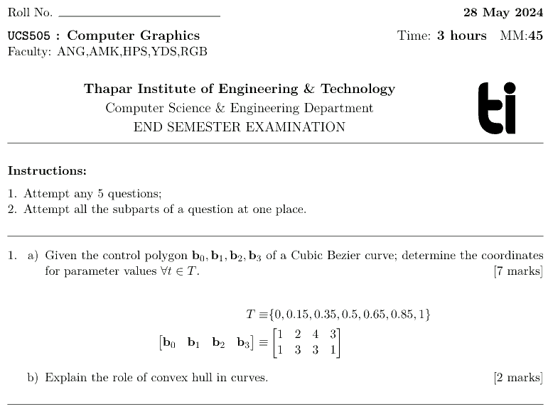

# `tiet-question-paper.cls` #

[Installation](#installation) | 
[Usage](#usage) | 
[Emacs Org Integration](#emacs-org-integration)

Author: Raghav B. Venkataramaiyer  
Email: bv.raghav -at- thapar -dot- edu  
Email: bvraghav -at- gmail -dot- com  
License: [MIT License](./LICENSE)  
Version: 2024-06-22

Provide a document class `tiet-question-paper` in order
to create a question paper for [the Thapar
Institute](https://thapar.edu/) in $\LaTeX$.  Although
created for the TIET, the module, however, is adaptable
to any organisation.

The following example is a screenshot from
[`sample.pdf`](./sample.pdf), with the source at
[`sample.tex`](./sample.tex)



## Installation ##

### CTAN ###

```sh
tlmgr --usermode --repository ctan install tiet-question-paper
```

In case there are errors like `pubkey missing`, or
`backups folder not found`; Try the following (may
require `root` permissions):
1. `mkdir -p /usr/share/tlpkg/backups`
2. `tlmgr --repository ctan update --self` 
2. `tlmgr --repository ctan install texlive-scripts`

And/ or (with local user login):
1. `mkdir -p /home/bvraghav/texmf/tlpkg/backups`

### From Source ###

1. `tlmgr init-usertree`
2. `kpsewhich -var-value=TEXMFHOME` should return
   `~/texmf`
3. `mkdir -p ~/texmf/tex/latex`
4. `cd ~/texmf/tex/latex`
5. `git clone
   git@github.com:bvraghav/qptiet_latex-class tiet-question-paper`
6. Verify that `kpsewhich tiet-question-paper.cls` finds `tiet-question-paper.cls`.

## Usage ##

## Overleaf Template ##

TBA

### Document Class ###

The document class is based on `article`.  And all the
options are passed forward as is.

```latex
\documentclass[11pt,onecolumn]{tiet-question-paper}
```

### Title Block ###

Only the following macros contribute to the title block.

```latex
\date{28 May 2024}
% \institute{Thapar Institute of Engineering \&
%   Technology}                   % Default value
% \abbrevinst{\textsc{tiet}}      % Reserved for future
% \instaddress{Patiala 147004}    % Reserved for future
% \cohort{}                       % Reserved for future
% \instlogo{images/tiet-logo.pdf} % Optional
\schoolordepartment{Computer Science \& Engineering Department}
\examname{End Semester Examination}
\coursecode{UCS505}
\coursename{Computer Graphics}
\timeduration{3 hours}
\maxmarks{45}
\faculty{ANG,AMK,HPS,YDS,RGB}
```

### Geometry ###

The class loads `geometry` package with following
default options,

```latex
\RequirePackage[%
  a4paper,%
  left=1in,%
  top=0.5in,%
  right=0.75in,%
  bottom=0.75in%
]{geometry}
```

However, a user may reconfigure using `\geometry`
command in [the
preamble](https://duckduckgo.com/?q=what+is+a+preamble+in+latex+document)
for example,

```latex
\geometry{letterpaper,bindingoffset=0.2in,
          left=1.2in,right=1.2in,top=.8in,bottom=.8in,
          footskip=.25in}
```

### Rules ###

```latex
\bvrhrule
\bvrhrule[2pt]
```
Create a horizontal rule with length equal to line
width and thickness `0.4pt` by default.  Optional
argument specifies line thickness.  Here’s the
implementation detail,

```latex
\DeclareRobustCommand%
% Horizontal rule after each question
\bvrhrule[1][0.4pt]{\rule{\linewidth}{#1}}
```

### Line Skip ###

```latex
\bvrskipline
\bvrskipline[1.2]
```

Create vertical blank space with height specified as a
factor of `\baselineskip`.  Optional argument specifies
the factor, `1.0` by default.  Here’s the
implementation detail,

```latex
\DeclareRobustCommand%
% Skip line
\bvrskipline[1][]{\vspace{#1\baselineskip}}
```

## Emacs Org Integration ##
Add the following to [the
init-file](https://www.gnu.org/software/emacs/manual/html_node/emacs/Init-File.html) 
```elisp
(add-to-list 'org-latex-classes
	     `("tiet-question-paper" "\\documentclass{tiet-question-paper}
[NO-DEFAULT-PACKAGES]
\\usepackage{amsmath}
\\usepackage{graphicx}
\\usepackage{wrapfig}
\\usepackage{amssymb}
\\usepackage[unicode]{hyperref}
" nil))
```

Here’s a [`sample-org`](./sample-org.org) file; that
produces a [`PDF`](./sample-org.pdf)
